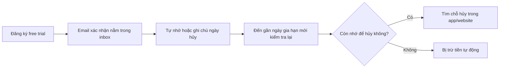
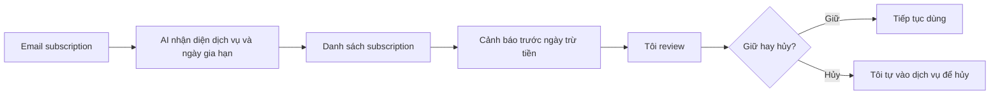
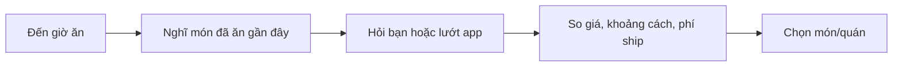
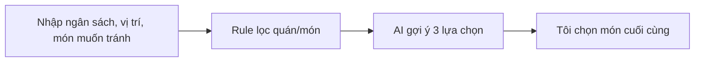
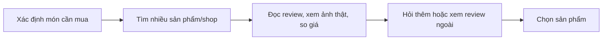
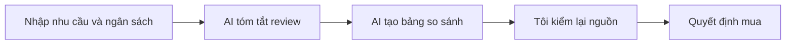

# 01 — Individual Problem Scan

> Điền theo Phase 1 + Phase 2 trong `01-worksheet.md`. Tự scan trước, dùng AI sau để phản biện. Không copy ví dụ Weekly Report.

## Thông tin cá nhân

- Họ và tên: Trần Quốc Sáng
- Mã học viên: 2A202602712
- Vai trò / bối cảnh (VD: sinh viên năm X, intern PM, ...): Sinh viên năm 4 Ngành Hệ Thống Thông Tin
- Công việc hằng tuần (3-5 gạch đầu dòng để soi problem):
  - Học tập và làm bài tập nhóm
  - Tham gia các hoạt động ngoại khóa và workshop
  - Quản lý thời gian và lịch trình cá nhân
  - Giao tiếp và hợp tác với bạn bè và giảng viên


---

## Phase 1 — Scan 5+ problems (tối thiểu 5, khuyến khích 8-10)

**Cách điền:** mỗi dòng = việc gì + ai chịu + đo bằng gì. Cột `Dấu hiệu thật` bắt buộc có số: mất bao lâu (bấm giờ mấy lần), mấy lần/tuần, bao nhiêu người gặp, log/ticket/quote nào.

| # | Lăng kính (Lặp lại / Tốn thời gian / AI có thể tốt hơn / Pain từ người khác) | Problem quan sát được | Ai chịu ảnh hưởng? | Dấu hiệu thật (số + bằng chứng) |
|---|---|---|---|---|
| 1 | Lặp lại  | Mỗi ngày tôi đều phải nghĩ xem ăn gì, ăn ở đâu sao cho vừa tiết kiệm, vừa không bị lặp món quá nhiều. | Bản thân tôi, sinh viên sống xa nhà/ở trọ. | Xảy ra khoảng 5-7 lần/tuần; mỗi lần mất 10-15 phút để nghĩ món, hỏi bạn hoặc lướt app đặt đồ ăn. |
| 2 | AI có thể tốt hơn | Tôi theo dõi chi tiêu cá nhân chưa đều vì tiền nằm rải rác ở nhiều nơi như tiền mặt, app ngân hàng, ví điện tử và app đặt đồ ăn. | Bản thân tôi. | Mỗi tuần mất khoảng 20-30 phút để nhớ lại đã tiêu gì; thường quên 2-3 khoản nhỏ như nước uống, gửi xe, ăn vặt. |
| 3 | Lặp lại  | Lịch cá nhân của tôi bị rối vì lịch học, deadline, lịch nhóm và việc cá nhân nằm ở nhiều app hoặc nhiều đoạn chat khác nhau. | Bản thân tôi. | Tôi phải kiểm tra lịch 1-2 lần/ngày; mỗi tuần có khoảng 1-2 lần phải hỏi lại bạn hoặc mở nhiều app để chắc deadline/giờ hẹn. |
| 4 | Tốn thời gian | Khi cần tìm lại thông tin cũ trong Zalo, Messenger, Discord hoặc email, tôi mất khá nhiều thời gian vì không nhớ đúng keyword để tìm. | Bản thân tôi và bạn bè/nhóm học tập. | Mỗi lần tìm mất khoảng 10-20 phút; xảy ra 2-3 lần/tuần, nhất là trước deadline hoặc khi cần tìm lại file/link cũ. |
| 5 | AI có thể tốt hơn | Khi mua đồ online như tai nghe, balo, chuột, đồ skincare hoặc quần áo, tôi phải đọc nhiều review nhưng vẫn khó biết sản phẩm nào thật sự hợp nhu cầu. | Bản thân tôi, người mua hàng online. | Xảy ra khoảng 2-3 lần/tháng; mỗi lần mất 30-60 phút để so sánh giá, review, phí ship và độ uy tín của shop. |
| 6 | Tốn thời gian | Trước khi ra khỏi nhà, tôi thường phải kiểm tra nhiều thứ như chìa khóa, ví, thẻ xe, laptop, sạc, tai nghe và tài liệu học. | Bản thân tôi. | Xảy ra gần như mỗi ngày; mỗi lần mất 3-5 phút để kiểm tra, thỉnh thoảng vẫn quên 1 món và phải quay lại lấy. |
| 7 | AI có thể tốt hơn | Tôi khó quản lý các tài khoản đăng ký dùng thử hoặc gói subscription vì mỗi dịch vụ có ngày gia hạn, cách hủy và email thông báo khác nhau. | Bản thân tôi, người dùng nhiều dịch vụ phần mềm, app giải trí hoặc công cụ AI. | Xảy ra khoảng 1-2 lần/tháng khi đăng ký hoặc kiểm tra gói dùng thử; mỗi lần kiểm tra email/app ngân hàng mất khoảng 10-20 phút. Nếu quên hủy trước ngày gia hạn thì có rủi ro bị trừ tiền cho dịch vụ không còn dùng. |

> Gợi ý tự soi: tuần trước mất nhiều thời gian nhất vào việc gì? Việc gì hay trì hoãn? Người khác hay hỏi lại câu gì? Workflow nào ai cũng biết là chậm?

**AI đã dùng ở Phase 1 (nếu có):**
- Prompt đã hỏi: Tôi đang làm bài Individual Problem Scan theo 4 lăng kính: lặp lại, tốn thời gian, AI có thể tốt hơn và pain từ người khác. Hãy gợi ý các problem đời sống/công việc hằng ngày có actor cụ thể, workflow rõ và dấu hiệu đo được.
- Ý dùng được: Các ý liên quan đến chi tiêu cá nhân, quản lý lịch, tìm lại thông tin cũ, mua đồ online và quản lý subscription/free trial.
- Ý bỏ vì không phải pain thật: Các ý quá rộng như xây trợ lý AI quản lý toàn bộ cuộc sống, tự động hóa mọi việc cá nhân, hoặc các problem không có actor và số đo rõ.

**Self-check Phase 1:**
- [x] Đủ 5+ dòng, mỗi dòng có actor + số đo cụ thể
- [x] Dùng ít nhất 3/4 lăng kính
- [x] Không có dòng chung chung kiểu "mất nhiều thời gian"

---

## Phase 2 — Top 3 Problem Cards

### 2.1. Chọn top 3

Giữ bài nào: actor cụ thể, workflow vẽ được 3-7 bước, bottleneck ở 1 bước, impact đo được. Loại bài quá rộng.

| Rank | Problem (copy từ bảng scan) | Vì sao chọn (2-3 ý) | Điều còn chưa chắc |
|---|---|---|---|
| 1 | Tôi khó quản lý các tài khoản đăng ký dùng thử hoặc gói subscription vì mỗi dịch vụ có ngày gia hạn, cách hủy và email thông báo khác nhau. | Đây là vấn đề khá thực tế vì nhiều dịch vụ hiện nay cho đăng ký dùng thử rất nhanh nhưng hủy lại khó nhớ và khó tìm. Problem có actor rõ, có rủi ro mất tiền thật, và workflow có thể vẽ được từ lúc đăng ký đến lúc bị trừ tiền hoặc hủy kịp. | Chưa đo được chính xác tổng số tiền có thể bị trừ oan trong một năm; cần kiểm tra lại email/app ngân hàng để có số cụ thể hơn. |
| 2 | Mỗi ngày tôi đều phải nghĩ xem ăn gì, ăn ở đâu sao cho vừa tiết kiệm, vừa không bị lặp món quá nhiều. | Tần suất cao, gần như ngày nào cũng gặp. Có thể đo bằng số phút chọn món mỗi lần và số lần phải hỏi bạn/lướt app trước khi quyết định. | Impact mỗi lần không quá lớn, cần xem tổng thời gian cộng lại theo tuần có đủ đáng giải quyết không. |
| 3 | Khi mua đồ online như tai nghe, balo, chuột, đồ skincare hoặc quần áo, tôi phải đọc nhiều review nhưng vẫn khó biết sản phẩm nào thật sự hợp nhu cầu. | Mỗi lần mua mất khá nhiều thời gian vì phải so sánh giá, review, phí ship và độ uy tín. AI có thể hỗ trợ bước tổng hợp/so sánh review nhưng người mua vẫn phải quyết định cuối. | Chất lượng review trên sàn thương mại điện tử không đồng đều, có thể có review ảo nên AI cũng dễ bị nhiễu nếu không có nguồn tốt. |

### 2.2. Problem Cards chi tiết (lặp lại cho cả 3 cards)

---

#### Problem Card #1 — Quản lý subscription / free trial (từ problem #7)

```text
Problem 1 câu:
Tôi khó quản lý các tài khoản dùng thử hoặc subscription vì ngày gia hạn, email thông báo và cách hủy nằm rải rác ở nhiều dịch vụ khác nhau, dẫn đến nguy cơ bị trừ tiền cho dịch vụ không còn dùng.

Actor:
Bản thân tôi, người dùng nhiều dịch vụ phần mềm, app giải trí hoặc công cụ AI.

Thời điểm / bối cảnh:
Khi đăng ký dùng thử một dịch vụ mới, hoặc khi gần đến ngày gia hạn/trừ tiền tự động.

Current workflow 3-7 bước:
1. Thấy một dịch vụ có free trial hoặc gói subscription hấp dẫn.
2. Đăng ký nhanh bằng email và thẻ ngân hàng.
3. Email xác nhận/gia hạn nằm trong hộp thư, đôi khi bị lẫn với nhiều email khác.
4. Tự nhớ ngày hết hạn hoặc ghi chú thủ công vào lịch.
5. Gần ngày gia hạn mới kiểm tra lại email/app ngân hàng/từng website dịch vụ.
6. Nếu còn nhớ thì vào website/app để tìm chỗ hủy gói.
7. Nếu quên thì có thể bị trừ tiền dù không còn dùng dịch vụ.

Bottleneck:
Thông tin về ngày gia hạn và cách hủy bị rải rác; người dùng phải tự nhớ, tự tìm email và tự kiểm tra từng dịch vụ. Bước kiểm tra lại thường mất khoảng 10-20 phút/lần.

Impact:
Mất thời gian kiểm tra thủ công 1-2 lần/tháng và có rủi ro bị trừ tiền cho dịch vụ không còn sử dụng. Vấn đề này khó chịu hơn vì tiền bị trừ tự động, thường chỉ phát hiện sau khi app ngân hàng báo giao dịch.

Success metric:
Giảm thời gian kiểm tra subscription từ 10-20 phút/lần xuống dưới 5 phút/lần; giảm số lần quên hủy gói dùng thử trước ngày gia hạn.

Non-AI alternative:
Tự tạo Google Calendar reminder ngay sau khi đăng ký, dùng bảng theo dõi thủ công hoặc checklist subscription hằng tháng.

AI hypothesis:
AI có thể đọc/tóm tắt email xác nhận đăng ký, nhận diện ngày hết trial/ngày gia hạn, gom thành danh sách subscription và nhắc trước ngày trừ tiền. Người dùng vẫn tự xác nhận và tự hủy dịch vụ khi cần.

Quick gut:
[ ] No AI / process fix
[ ] Rule
[x] Workflow
[ ] Agent
[ ] Chưa biết
```

**Draft workflow Card #1** (ASCII / Mermaid / ảnh đính kèm):



```text
CURRENT STATE — 10-20 phút/lần kiểm tra

[1 Đăng ký free trial: 2']
→ [2 Email xác nhận nằm trong inbox: không kiểm ngay]
→ [3 Tự nhớ hoặc ghi chú ngày hủy: 3-5']
→ [4 Gần ngày gia hạn phải tìm lại email/app ngân hàng/website: 10-20']  <-- bottleneck
→ [5 Tìm chỗ hủy trong từng dịch vụ: 5-15']
→ [6 Hủy kịp hoặc bị trừ tiền]

FUTURE STATE — dưới 5 phút/lần kiểm tra

[1 Email subscription được gom lại]
→ [2 AI nhận diện tên dịch vụ, ngày hết trial, ngày gia hạn]
→ [3 Tạo danh sách subscription + cảnh báo trước hạn]
→ [4 Tôi review danh sách và quyết định giữ/hủy]  <-- human boundary
→ [5 Tôi tự vào dịch vụ để hủy nếu cần]

Fallback: nếu AI nhận diện sai ngày hoặc thiếu dịch vụ thì tôi kiểm tra lại email gốc/app ngân hàng và sửa thủ công.
```



File đính kèm (nếu vẽ riêng): `01-individual-problem-scan-workflow-card-1.png`

---

#### Problem Card #2 — Chọn ăn gì, ăn ở đâu

```text
Problem 1 câu:
Mỗi ngày tôi mất thời gian quyết định ăn gì, ăn ở đâu sao cho vừa tiết kiệm, vừa hợp khẩu vị và không bị lặp món quá nhiều.

Actor:
Bản thân tôi, sinh viên sống xa nhà/ở trọ.

Thời điểm / bối cảnh:
Vào giờ ăn trưa hoặc ăn tối, đặc biệt khi không chuẩn bị đồ ăn sẵn.

Current workflow 3-7 bước:
1. Đến giờ ăn nhưng chưa biết ăn gì.
2. Nghĩ lại các món đã ăn gần đây để tránh bị lặp.
3. Hỏi bạn hoặc lướt app đặt đồ ăn/quán gần đó.
4. So giá, khoảng cách, phí ship hoặc thời gian chờ.
5. Chọn món/quán và đặt hoặc đi ăn.

Bottleneck:
Bước chọn món/quán mất 10-15 phút vì phải cân bằng nhiều tiêu chí nhỏ: giá, khẩu vị, khoảng cách, món đã ăn gần đây.

Impact:
Xảy ra 5-7 lần/tuần. Tổng thời gian suy nghĩ/chọn món có thể khoảng 50-100 phút/tuần, chưa kể cảm giác mệt vì ngày nào cũng phải quyết định lại.

Success metric:
Giảm thời gian chọn món từ 10-15 phút xuống dưới 5 phút/lần; giảm số lần phải hỏi lại bạn hoặc lướt nhiều app trước khi quyết định.

Non-AI alternative:
Tạo danh sách quán quen theo ngân sách, lên thực đơn đơn giản theo tuần hoặc dùng rule xoay vòng món.

AI hypothesis:
AI có thể gợi ý 3-5 lựa chọn dựa trên ngân sách, món đã ăn gần đây, vị trí và sở thích. Người dùng vẫn chọn quyết định cuối.

Quick gut:
[ ] No AI / process fix
[x] Rule
[x] Workflow
[ ] Agent
[ ] Chưa biết
```

**Draft workflow Card #2:**



```text
CURRENT STATE — 10-15 phút/lần

[1 Đến giờ ăn]
→ [2 Nghĩ món đã ăn gần đây]
→ [3 Hỏi bạn/lướt app/quán gần đó: 10-15']  <-- bottleneck
→ [4 So giá, khoảng cách, phí ship]
→ [5 Chọn món/quán]

FUTURE STATE — dưới 5 phút/lần

[1 Nhập ngân sách + vị trí + món muốn tránh]
→ [2 Rule lọc quán/món theo tiêu chí]
→ [3 AI gợi ý 3 lựa chọn ngắn gọn]
→ [4 Tôi chọn món cuối cùng]  <-- human boundary

Fallback: nếu gợi ý không hợp khẩu vị hoặc giá không đúng thực tế thì quay lại danh sách quán quen/rule xoay vòng món.
```



File đính kèm: `01-individual-problem-scan-workflow-card-2.png`

---

#### Problem Card #3 — Chọn mua đồ online

```text
Problem 1 câu:
Khi mua đồ online, tôi mất nhiều thời gian đọc review và so sánh sản phẩm nhưng vẫn khó biết món nào thật sự hợp nhu cầu.

Actor:
Bản thân tôi, người mua hàng online.

Thời điểm / bối cảnh:
Khi cần mua các món như tai nghe, balo, chuột, đồ skincare hoặc quần áo trên sàn thương mại điện tử.

Current workflow 3-7 bước:
1. Xác định món cần mua và ngân sách.
2. Tìm kiếm trên sàn thương mại điện tử hoặc Google.
3. Mở nhiều sản phẩm/shop để so sánh giá, lượt bán, phí ship.
4. Đọc review tốt/xấu, xem ảnh thật và đánh giá độ uy tín.
5. Hỏi thêm bạn bè hoặc xem review ngoài nếu vẫn phân vân.
6. Chọn sản phẩm và đặt mua.

Bottleneck:
Bước đọc và so sánh review mất 30-60 phút/lần vì thông tin nhiều, có review thật/review ảo lẫn nhau, và mỗi shop trình bày khác nhau.

Impact:
Xảy ra khoảng 2-3 lần/tháng. Nếu chọn sai sản phẩm thì mất thêm thời gian đổi/trả hoặc phải mua lại món khác.

Success metric:
Giảm thời gian so sánh từ 30-60 phút xuống còn 15-20 phút/lần; tăng độ tự tin khi chọn sản phẩm bằng checklist nhu cầu rõ ràng.

Non-AI alternative:
Dùng checklist mua hàng thủ công: ngân sách, số review, lượt bán, chính sách đổi trả, shop uy tín, review ảnh thật.

AI hypothesis:
AI có thể tóm tắt review, phân loại ưu/nhược điểm theo nhu cầu và tạo bảng so sánh ngắn. Người mua vẫn kiểm lại nguồn và tự quyết định mua.

Quick gut:
[ ] No AI / process fix
[ ] Rule
[x] Workflow
[ ] Agent
[ ] Chưa biết
```

**Draft workflow Card #3:**



```text
CURRENT STATE — 30-60 phút/lần mua

[1 Xác định món cần mua]
→ [2 Tìm nhiều sản phẩm/shop]
→ [3 Đọc review, xem ảnh thật, so giá: 30-60']  <-- bottleneck
→ [4 Hỏi thêm hoặc xem review ngoài]
→ [5 Chọn sản phẩm]

FUTURE STATE — 15-20 phút/lần mua

[1 Nhập nhu cầu + ngân sách]
→ [2 AI tóm tắt review/ưu nhược điểm]
→ [3 AI tạo bảng so sánh ngắn]
→ [4 Tôi kiểm lại nguồn và quyết định mua]  <-- human boundary

Fallback: nếu AI tóm tắt thiếu hoặc nguồn review không đáng tin thì quay lại checklist thủ công và ưu tiên shop có chính sách đổi trả rõ.
```



File đính kèm: `01-individual-problem-scan-workflow-card-3.png`

---

### 2.3. Card muốn pitch nhất (chuẩn bị 2 phút)

**Card tôi muốn pitch nhất:**

```text
Problem Card #1 — Quản lý subscription / free trial (từ problem #7)
```

**Vì sao (2-3 câu: workflow gì, số đo gì, impact gì):**

```text
Tôi muốn pitch card này vì nó có pain khá rõ: chỉ cần quên một lần là có thể bị trừ tiền thật, không chỉ mất thời gian. Workflow hiện tại cũng dễ vẽ: đăng ký free trial → email xác nhận nằm rải rác → tự nhớ ngày hủy → kiểm tra thủ công → hủy kịp hoặc bị trừ tiền. Nếu làm tốt, success metric có thể là giảm thời gian kiểm tra subscription từ 10-20 phút/lần xuống dưới 5 phút/lần và giảm số lần quên hủy trước ngày gia hạn.
```

**Câu hỏi tôi muốn nhóm challenge (1-2 câu hỏi đúng chỗ yếu):**

```text
Pain này có xảy ra đủ thường xuyên với nhiều người không, hay chỉ là vấn đề của một nhóm người dùng nhiều dịch vụ? Nếu không dùng AI, chỉ cần Google Calendar reminder hoặc checklist thủ công thì đã đủ giải quyết 70-80% case chưa?
```

**AI phản biện Card (nếu có):**
- Điểm yếu AI chỉ ra: Problem này có thể chưa xảy ra hằng tuần như các problem khác, nên cần chứng minh impact bằng rủi ro mất tiền và số dịch vụ đang dùng, không chỉ bằng tần suất.
- Tôi sửa gì: Thu hẹp scope thành quản lý free trial/subscription cá nhân, không để AI tự hủy dịch vụ. AI chỉ hỗ trợ nhận diện email, ngày gia hạn và nhắc trước; người dùng vẫn review và tự quyết định hủy hay giữ.

### Self-check nộp phần 01
- [x] Có 5+ problems + top 3 Cards đủ field
- [x] Mỗi Card có workflow trước/sau + bottleneck + metric + fallback
- [x] Đã chọn 1 card pitch + câu hỏi challenge
