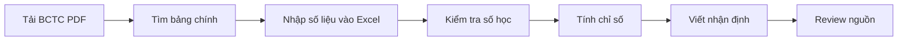
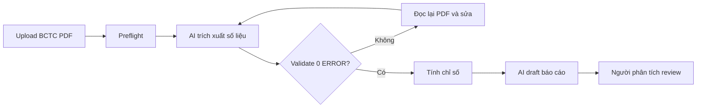

# 02 — Group Problem Statement (Bản nộp nhóm)

> Làm chung 1 bản, mỗi thành viên copy vào repo cá nhân. Đi theo Phase 3 → 6 trong `01-worksheet.md`. Nhóm chỉ chọn **candidate problem** ở Phase 3, viết Problem Statement sau khi validate + vẽ workflow.

## Thành viên nhóm

| STT | Họ và tên | Mã học viên | Vai trò trong nhóm |
|-----|-----------|-------------|-------------------|
| 1 | Trần Quốc Sáng | 02712 | Facilitator + tổng hợp Problem Statement |
| 2 | Lê Công Tâm | 02406 | Workflow mapper |
| 3 | Nguyễn Quang Tuấn | 02470 | Research giải pháp |
| 4 | Nguyễn Đình Anh Đức | 02856 | Metric + validation |
| 5 | Đoàn Phương Linh | 02382 | Writer + reviewer |

**Candidate problem nhóm chọn (1 câu):**

Researcher, sinh viên phân tích tài chính hoặc analyst mất nhiều thời gian đọc BCTC doanh nghiệp Việt Nam từ PDF để trích số liệu, tính chỉ số và viết nhận định; nếu không có kiểm tra số học và truy vết nguồn thì báo cáo rất dễ sai.

---

## Phase 3 — Group Convergence: từ 15 candidates về 1

### 3.1. Trình bày top 3 mỗi người

| # | Người đưa ra | Candidate problem | Người gặp vấn đề | Điểm nghẽn | Cảm nhận nhanh của nhóm |
|---|---|---|---|---|---|
| 1 | Trần Quốc Sáng | Quản lý subscription/free trial bị quên ngày gia hạn | Người dùng nhiều dịch vụ số | Ngày gia hạn, email thông báo và cách hủy nằm rải rác | Gần đời sống, có rủi ro mất tiền thật nhưng tần suất không cao bằng các bài khác |
| 2 | Trần Quốc Sáng | Mỗi ngày phải quyết định ăn gì, ăn ở đâu sao cho tiết kiệm và không lặp món | Sinh viên sống xa nhà/ở trọ | Phải cân bằng giá, khẩu vị, khoảng cách, món đã ăn gần đây | Tần suất cao nhưng impact từng lần nhỏ |
| 3 | Trần Quốc Sáng | Khi mua đồ online phải đọc nhiều review nhưng vẫn khó biết sản phẩm nào hợp nhu cầu | Người mua hàng online | Review nhiều, nhiễu, khó phân biệt thật/ảo | Có AI fit nhưng nguồn dữ liệu khó kiểm chứng |
| 4 | Nguyễn Đình Anh Đức | Đọc nhiều file source code để hiểu luồng xử lý trước khi sửa một chức năng | Developer/sinh viên mới vào project | Context nằm rải rác trong nhiều file, mất thời gian lần theo flow | Workflow rõ, AI có thể hỗ trợ đọc hiểu code |
| 5 | Nguyễn Đình Anh Đức | Đối chiếu CV với mô tả công việc để xác định kỹ năng còn thiếu và từ khóa cần bổ sung | Sinh viên/người tìm việc | Phải đọc JD, đọc CV, so gap thủ công | Thiết thực, nhưng dễ thành bài review CV chung |
| 6 | Nguyễn Đình Anh Đức | Thành viên mới gặp khó khăn khi tìm tài liệu và setup project | Thành viên mới trong nhóm dev | Tài liệu setup phân tán, thiếu bước hoặc lỗi thời | Pain thật, nhưng có thể giải bằng README/checklist |
| 7 | Đoàn Phương Linh | Hệ thống tự động hóa tổng hợp dữ liệu báo cáo tuần và liên thông dữ liệu nội bộ | Nhân viên vận hành/quản lý | Dữ liệu nằm ở nhiều file/hệ thống, tổng hợp thủ công | Có impact doanh nghiệp, nhưng scope tích hợp dữ liệu khá rộng |
| 8 | Đoàn Phương Linh | Trợ lý AI cá nhân hóa nội dung tư vấn và tự động báo giá theo hồ sơ khách hàng | Sales/tư vấn khách hàng | Phải hiểu hồ sơ khách và soạn tư vấn/báo giá riêng | Hay nhưng cần dữ liệu khách hàng và rủi ro sai báo giá |
| 9 | Đoàn Phương Linh | Hệ thống quản lý và cảnh báo thông minh chi phí định kỳ SaaS & Infrastructure | Doanh nghiệp dùng nhiều SaaS/cloud | Chi phí định kỳ phân tán, khó phát hiện khoản tăng bất thường | Gần với problem subscription nhưng ở mức doanh nghiệp |
| 10 | Lê Công Tâm | Ghi chép, tổng hợp meeting notes và action items sau buổi họp nhóm làm bài tập | Nhóm sinh viên làm bài tập | Sau họp phải nghe lại/đọc lại để chốt task | Workflow rõ, AI hỗ trợ ngôn ngữ tốt |
| 11 | Lê Công Tâm | Tìm lại link tài liệu, bài mẫu hoặc quyết định cũ bị trôi trong Discord/Zalo | Sinh viên trong lớp/nhóm học tập | Không nhớ keyword, thông tin trôi trong chat | Pain lặp lại cao, nhưng vướng data access |
| 12 | Lê Công Tâm | Kiểm tra tự rà soát file nộp bài tập: Markdown, cấu trúc folder, đủ field đề bài | Sinh viên nộp lab | Kiểm tra thủ công trước deadline | Rule/script có thể xử lý phần lớn |
| 13 | Nguyễn Quang Tuấn | Phân tích báo cáo tài chính doanh nghiệp Việt Nam từ PDF | Researcher/sinh viên phân tích tài chính | Trích số liệu từ PDF, tính chỉ số, nhận diện cảnh báo | Actor rõ, workflow rõ, impact đo được, phù hợp hướng skill |
| 14 | Nguyễn Quang Tuấn | Tìm lại nguồn/số liệu đã trích dẫn khi viết báo cáo nhóm | Nhóm viết báo cáo/research | Nguồn và số liệu rải rác trong file/chat/link | Pain thật, nhưng có thể là vấn đề thói quen ghi nguồn |
| 15 | Nguyễn Quang Tuấn | So sánh nhiều nguồn tham khảo khi survey kiến thức mới | Researcher/sinh viên làm survey | Đọc nhiều nguồn rồi tổng hợp bảng so sánh | Có AI fit, nhưng cần kiểm độ trung thực của tóm tắt |

### 3.2. Gom trùng / cluster

| Cluster | Candidates included | Pattern chung | Ghi chú |
|---|---|---|---|
| A | #13, #14, #15, #4 | Đọc nhiều tài liệu/source, trích xuất thông tin, tổng hợp thành nhận định có căn cứ | Cụm research/analysis mạnh nhất; trong đó #13 có workflow và metric rõ nhất |
| B | #7, #9, #1 | Theo dõi dữ liệu/chi phí/subscription định kỳ và cảnh báo khi có rủi ro | Có impact rõ nhưng một số bài cần tích hợp nhiều hệ thống |
| C | #10, #11, #12, #6 | Quản lý thông tin nhóm học tập/project: note, link, setup, checklist nộp bài | Gần với trải nghiệm sinh viên, nhưng nhiều bài có thể giải bằng rule/checklist |
| D | #2, #3, #5, #8 | Ra quyết định cá nhân/tư vấn dựa trên nhiều tiêu chí và nhiều nguồn thông tin | Có AI fit nhưng metric và data quality không đồng đều |

### 3.3. Shortlist

| Candidate | Vì sao vào shortlist | Rủi ro / điều chưa rõ |
|---|---|---|
| Phân tích báo cáo tài chính doanh nghiệp Việt Nam từ PDF | Actor rõ là researcher/sinh viên phân tích tài chính; workflow trích số liệu → kiểm tra → tính chỉ số → nhận diện cảnh báo rất rõ; impact đo được bằng thời gian tiết kiệm và số lỗi giảm | Chưa chắc độ chính xác trích xuất số liệu từ PDF scan/ảnh đạt yêu cầu; vẫn cần review bằng tay |
| Đọc nhiều file source code để hiểu luồng xử lý trước khi sửa một chức năng | Developer nào cũng gặp; AI có thể hỗ trợ đọc hiểu, tóm tắt flow và chỉ ra file liên quan | Cần quyền đọc code; AI có thể hiểu sai luồng nếu thiếu context hoặc repo quá lớn |
| Ghi chép, tổng hợp meeting notes và action items sau buổi họp nhóm | Workflow họp-note rõ; bottleneck nằm ở xử lý ngôn ngữ; dễ đo bằng thời gian và số task bị rơi | AI có thể sai nếu audio/note lộn xộn, dùng từ viết tắt hoặc nói thiếu chủ ngữ |

### 3.4. Score để đồng thuận

| Candidate | Actor rõ | Workflow rõ | Pain có evidence | Impact đo được | Làm trong lab | So sánh R/W/A được | Nhóm hiểu domain | Tổng |
|---|---:|---:|---:|---:|---:|---:|---:|---:|
| Phân tích báo cáo tài chính doanh nghiệp Việt Nam từ PDF | 5 | 5 | 4 | 5 | 4 | 5 | 5 | 33 |
| Đọc nhiều file source code để hiểu luồng xử lý | 5 | 4 | 4 | 4 | 4 | 4 | 5 | 30 |
| Tổng hợp meeting notes và action items | 5 | 5 | 4 | 4 | 5 | 4 | 4 | 31 |

Nhóm chọn: **Phân tích báo cáo tài chính doanh nghiệp Việt Nam từ PDF**.

```text
Phân tích báo cáo tài chính doanh nghiệp Việt Nam từ PDF.
```

**Vì sao chọn:**

```text
Nhóm chọn candidate của Tuấn vì đây là bài có actor, workflow và metric rõ nhất. Người làm phân tích phải đi qua một chuỗi việc rất cụ thể: đọc BCTC PDF, trích xuất số liệu, kiểm tra số học, tính chỉ số, nhận diện cảnh báo và viết báo cáo. Pain không nằm ở chuyện “AI viết báo cáo cho hay”, mà nằm ở việc số liệu phải đúng, có nguồn để truy lại, và có người review trước khi dùng. So với các ý khác, bài này có boundary tốt hơn: AI không tự bịa số, không tự kết luận đầu tư, mà chỉ hỗ trợ một workflow có kiểm tra.
```

**Vì sao KHÔNG chọn các candidate còn lại:**

```text
Meeting notes và tìm lại link tài liệu là pain thật, nhưng nhóm thấy các bài này dễ được giải một phần bằng công cụ sẵn có như transcript, search hoặc checklist. Bài đọc source code cũng mạnh, nhưng cần một repo cụ thể để kiểm chứng và có rủi ro AI hiểu sai context kỹ thuật. Các bài subscription, mua đồ online, CV/JD và báo giá khách hàng đều thiết thực, nhưng hoặc impact nhỏ hơn, hoặc cần dữ liệu cá nhân/khách hàng nhạy cảm, hoặc scope tích hợp quá rộng cho lab.
```

**Disagreement:**

```text
Một số thành viên lo bài BCTC quá kỹ thuật và trích xuất PDF có thể sai. Nhóm thống nhất không làm “AI phân tích tài chính toàn năng”, mà giữ scope nhỏ: phân tích BCTC doanh nghiệp Việt Nam theo mẫu VAS, ưu tiên MWG làm case minh họa, chỉ tạo bản nháp có truy vết nguồn và luôn có người review trước khi dùng.
```

---

## Phase 4 — Quick Validation + Research

### 4.1. Quick validation

| Nguồn | Số người / mẫu | Tín hiệu xác nhận | Tín hiệu phản bác | Nhóm sửa problem thế nào |
|---|---:|---|---|---|
| Quick interview nội bộ | 5 thành viên | Nhóm đồng ý rằng đọc BCTC PDF, nhập số liệu và kiểm tra công thức là bước dễ mất thời gian. Quote: “Sai một dòng số liệu là kéo sai toàn bộ chỉ số sau đó.” | Có thành viên nói nếu chỉ cần đọc nhanh thì báo cáo phân tích có sẵn có thể đủ | Thu hẹp problem vào nhu cầu tạo báo cáo có số liệu truy vết được, không chỉ tóm tắt nhanh |
| Kế hoạch kiểm chứng tiếp | 2-3 người từng phân tích BCTC | Cần hỏi thời gian làm thủ công, lỗi thường gặp, bước đau nhất | Chưa có khảo sát thật ngoài nhóm | Không dùng số tiết kiệm thời gian như fact tuyệt đối, chỉ đặt target pilot |

**Insight sau validation:**

```text
Pain thật nằm ở việc biến BCTC PDF nhiều năm thành báo cáo có số liệu đáng tin. Nếu chỉ để AI viết nhận định mà không có kiểm tra số học và trích dẫn nguồn, output khó dùng trong bối cảnh phân tích tài chính.
```

Bằng chứng đính kèm: chưa có file riêng; phần validation hiện tại là quick interview nội bộ và review tài liệu skill.

### 4.2. Research giải pháp đã có

| Nguồn / tool / case | Link | Họ giải quyết phần nào? | Điểm mạnh | Khoảng trống / rủi ro | Bài học cho nhóm |
|---|---|---|---|---|---|
| MWG - Công bố thông tin | https://mwg.vn/cong-bo-thong-tin | Cung cấp tài liệu chính thức cho cổ đông và nhà đầu tư | Nguồn đầu vào chính thống khi chọn MWG làm case minh họa | Không tự phân tích hoặc tính chỉ số | Dữ liệu đầu vào nên lấy từ nguồn chính thức |
| Docsumo extraction | https://support.docsumo.com/docs/extraction | Trích xuất dữ liệu từ tài liệu/bảng | Cho thấy pattern document extraction + review | Tool generic, chưa chắc map đúng BCTC Việt Nam | Cần schema riêng cho BCTC/VAS |
| Microsoft Copilot finance scenarios | https://enablement.microsoft.com/en-us/scenario-library/finance/ | AI hỗ trợ công việc finance như phân tích, forecasting, compliance | Cho thấy AI trong finance thường hỗ trợ người làm tài chính | Không giải trực tiếp bài BCTC Việt Nam PDF có mã số/trích dẫn | Human review vẫn là boundary quan trọng |

**Research takeaway:**

```text
Không nên build một agent tự đọc, tự kết luận và tự gửi báo cáo. Hướng hợp lý là workflow: script/rule xử lý phần tính toán và kiểm tra, AI hỗ trợ trích xuất/diễn giải, người phân tích tài chính review trước khi dùng. Bài học lớn nhất từ research là trong finance, output có vẻ “hợp lý” chưa đủ; phải có nguồn, có validation và có người chịu trách nhiệm.
```

---

## Phase 5 — Workflow + Problem Statement

### 5.1. Current workflow bản nhóm

Dán workflow hoặc link file: [02-group-problem-statement-workflow.md]

```text
CURRENT STATE — khoảng 3-5 giờ/doanh nghiệp nếu làm thủ công

[1 Tải BCTC PDF: 10' - researcher]
→ [2 Tìm bảng BCĐKT/KQKD/LCTT: 20']
→ [3 Nhập số liệu vào Excel: 90-150']  <-- bottleneck
→ [4 Kiểm tra công thức và đối chiếu tổng: 30-60']
→ [5 Tính chỉ số tài chính: 30']
→ [6 Viết nhận định/cảnh báo: 45-60']
→ [7 Review lại nguồn: 30']
```



| Bước | Actor | Input | Output | Thời gian / tần suất | Ghi chú |
|---|---|---|---|---|---|
| 1 | Researcher/analyst | Link/PDF BCTC | Bộ PDF theo năm | 10 phút/lần phân tích | Cần lấy đúng tài liệu |
| 2 | Researcher/analyst | PDF nhiều trang | Trang bảng chính | 20 phút | Dễ nhầm trang/đơn vị |
| 3 | Researcher/analyst | Bảng trong PDF | Excel/raw table | 90-150 phút | Bottleneck chính |
| 4 | Researcher/analyst | Raw table | Bảng đã kiểm tra | 30-60 phút | Sai thì phải đọc lại PDF |
| 5 | Researcher/analyst | Số liệu sạch | Bộ chỉ số | 30 phút | Công thức phải nhất quán |
| 6 | Researcher/analyst | Chỉ số + xu hướng | Draft nhận định | 45-60 phút | Cần có số đi kèm |
| 7 | Reviewer | Draft báo cáo | Báo cáo đã soát | 30 phút | Boundary trước khi dùng |

**Bottleneck chính:**

```text
Bottleneck chính là trích xuất và đối chiếu số liệu từ PDF sang bảng dữ liệu. Bước này vừa tốn thời gian vừa rủi ro vì một lỗi ở dữ liệu gốc có thể làm sai toàn bộ chỉ số và nhận định phía sau.
```

### 5.2. Future workflow bản nhóm

```text
FUTURE STATE — khoảng 45-75 phút/doanh nghiệp trong pilot

[1 Upload/tải BCTC PDF: 5' - người dùng]
→ [2 Rule/script preflight xác định năm, trang, đơn vị: 5']
→ [3 AI hỗ trợ trích xuất bảng chính: 15-25']
→ [4 Script validate số học và nguồn: 5-10']  <-- machine gate
→ [5 Script tính chỉ số + xu hướng/cảnh báo: 5']
→ [6 AI draft báo cáo có trích dẫn: 10-15']
→ [7 Người phân tích review: 15-30']  <-- human boundary

Fallback: nếu validate báo lỗi hoặc AI đọc số không chắc, quay lại PDF gốc để sửa; nếu vẫn không chắc thì giữ trạng thái bản nháp và không dùng để ra quyết định.
```



**Before/after impact:**

| Metric | Trước | Sau kỳ vọng | Cách đo |
|---|---:|---:|---|
| Tổng thời gian | 3-5 giờ | 45-75 phút | Bấm giờ từ lúc có PDF đến lúc có draft |
| Số bước | 7 | 7 | Đếm bước workflow |
| Số bước thủ công | 7/7 | 2-3/7 | Upload, sửa lỗi nếu có, review |
| Bottleneck chính | Nhập số liệu thủ công | Review lỗi đọc PDF/uncertain fields | Đếm lỗi validate và số ô cần sửa |
| Risk mới | Lỗi nhập tay | AI/OCR đọc sai số hoặc diễn giải quá mức | Validate + trích dẫn + reviewer checklist |

Bottleneck mới:

```text
Sau khi tối ưu, bottleneck không còn là nhập số liệu thủ công mà chuyển sang bước review các số AI đọc chưa chắc và phần diễn giải của báo cáo. Đây là bottleneck chấp nhận được vì nó là điểm kiểm soát chất lượng trước khi báo cáo được dùng.
```

### 5.3. Problem Statement v0

| Field | Nội dung |
|---|---|
| **Actor** | Researcher, sinh viên phân tích tài chính hoặc analyst cần phân tích BCTC doanh nghiệp Việt Nam từ PDF. |
| **Workflow** | Tải BCTC PDF, tìm bảng chính, nhập số liệu, kiểm tra số học, tính chỉ số, viết nhận định và review nguồn. |
| **Bottleneck** | Trích xuất và kiểm tra số liệu từ PDF là bước chậm nhất, dễ sai nhất. |
| **Impact** | Làm thủ công có thể mất 3-5 giờ/doanh nghiệp; lỗi số liệu làm sai chỉ số và nhận định. |
| **Success Metric** | Giảm thời gian tạo draft xuống 45-75 phút; validate đạt 0 ERROR; 100% số liệu chính có nguồn. |
| **Boundary** | AI không tự bịa số, không tự kết luận mua/bán, không tự gửi báo cáo chính thức. Người thật phải review và chịu trách nhiệm trước khi dùng. |

**Câu hỏi AI phản biện v0 (nếu có):**
- Field nào mơ hồ: Baseline 3-5 giờ cần đo bằng pilot thật.
- Tôi sửa gì: Ghi rõ đây là target pilot, thêm cổng validate và người review.

---

## Phase 6 — Rule / Workflow / Agent + Decision

### 6.0. Ma trận độ phù hợp

- Độ mơ hồ: [ ] Thấp / [x] Cao — Vì sao: số liệu có đúng/sai rõ, nhưng phần nhận định tài chính có nhiều cách viết hợp lệ.
- Độ phức tạp: [ ] Thấp / [x] Cao — Vì sao: workflow có nhiều bước phụ thuộc nhau: PDF → trích xuất → validate → tính chỉ số → báo cáo → review.

**Bài toán nhóm nằm ở ô nào:**

```text
Độ mơ hồ cao + độ phức tạp cao, nhưng phù hợp với Workflow hơn Agent toàn quyền.
```

**Vì sao:**

```text
Phần tính toán và kiểm tra nên để rule/script làm vì cần đúng tuyệt đối. Phần đọc PDF và viết nhận định có thể dùng AI, nhưng phải có validate và reviewer làm boundary.
```

### 6.1. So sánh Rule / Workflow / Agent

| Mức | Phương án cho bài toán nhóm | Khi nào đủ | Rủi ro | Chọn? |
|---|---|---|---|---|
| **No AI / process fix** | Dùng Excel template, checklist mã số, quy định lưu nguồn ngay khi trích số liệu | Đủ nếu nhóm chỉ phân tích ít chỉ tiêu và PDF dễ đọc | Vẫn tốn nhiều thời gian nhập số và viết nhận định; khó mở rộng nhiều năm | Không chọn làm phương án chính, nhưng dùng làm fallback |
| **Rule** | Công thức Excel/script tính chỉ số + checklist nguồn + validation rule | Đủ nếu dữ liệu đã sạch ở dạng bảng | Không giải quyết tốt PDF scan và phần diễn giải | Dùng cho validate/công thức |
| **Workflow** | PDF → preflight → AI trích xuất → validate → tính chỉ số → AI draft → review | Đủ cho scope BCTC Việt Nam 2-5 năm | AI đọc sai số nếu không kiểm | **Chọn** |
| **Agent** | Agent tự tìm PDF, đọc, tính, viết và gửi | Chỉ phù hợp khi có permission/logging rất chặt | Quá rủi ro trong domain tài chính | Không chọn |

**5 câu hỏi chốt:**
1. Rule có giải được 70-80% case không?  
Không. Rule giúp tính toán và kiểm tra, nhưng chưa xử lý tốt việc đọc PDF và viết nhận định.

2. Các bước có đi thẳng một đường không hay phải rẽ nhánh?  
Phần lớn đi thẳng, nhưng có nhánh quay lại khi validate báo lỗi.

3. Có thật sự cần Agent tự lập kế hoạch + gọi tool không?  
Chưa cần. Workflow tuần tự là đủ cho pilot.

4. Nếu AI sai, ai phát hiện đầu tiên và sửa trong bao lâu?  
Script validate phát hiện lỗi số học; người phân tích phát hiện lỗi diễn giải khi review, dự kiến 15-30 phút.

5. Có hạ được từ Agent → Workflow → Rule không?  
Có. Nhóm hạ từ “AI tự phân tích tài chính” xuống workflow có rule/script và human review.

**Mức chọn:**

```text
Workflow
```

**Vì sao chọn:**

```text
Workflow phù hợp vì bài toán có nhiều bước rõ ràng và cần phối hợp giữa rule/script, AI và người review. Rule/script xử lý phần số liệu; AI hỗ trợ trích xuất và viết draft; người phân tích giữ quyền duyệt cuối.
```

**Vì sao không chọn mức đơn giản hơn:**

```text
No AI/process fix và Rule chỉ đủ nếu dữ liệu đã sạch hoặc phạm vi rất nhỏ. Pain chính nằm ở PDF nhiều trang, bước trích xuất số liệu và việc viết nhận định có ngữ cảnh, nên cần workflow có AI hỗ trợ nhưng vẫn bị chặn bởi validation và review.
```

### 6.2. Problem Statement v1

| Field | Nội dung |
|---|---|
| **Actor** | Researcher, sinh viên phân tích tài chính hoặc analyst cần phân tích BCTC doanh nghiệp Việt Nam trong 2-5 năm. |
| **Workflow** | Tải BCTC từ nguồn chính thức → xác định trang/đơn vị → trích xuất số liệu → validate → tính chỉ số → draft báo cáo → review. |
| **Bottleneck** | Trích xuất và đối chiếu số liệu từ PDF sang bảng dữ liệu mất 90-150 phút và dễ sai. |
| **Impact** | Làm thủ công mất khoảng 3-5 giờ/doanh nghiệp; lỗi ở dữ liệu gốc có thể làm sai báo cáo phân tích. |
| **Success Metric** | Giảm thời gian tạo draft xuống 45-75 phút; validate 0 ERROR; 100% số liệu chính có trích dẫn; reviewer không phải viết lại quá 30% nội dung. |
| **Boundary** | Làm: hỗ trợ trích xuất, kiểm tra, tính chỉ số, draft báo cáo. Không làm: không bịa số, không khuyến nghị mua/bán, không gửi báo cáo chính thức, không gỡ nhãn bản nháp nếu chưa review. |
| **AI intervention point** | Sau khi có PDF và trước khi tạo bảng dữ liệu; sau khi có chỉ số để draft phần diễn giải. |
| **Mức chọn** | Workflow, vì các bước đủ rõ để điều phối tuần tự nhưng vẫn cần AI ở phần đọc/viết. |
| **Rủi ro & người thật kiểm tra** | Rủi ro lớn nhất là AI/OCR đọc sai số hoặc diễn giải quá mức. Người phân tích kiểm tra bằng cách đối chiếu số trọng yếu với PDF và xem validation report. |

### 6.3. Final decision

| Câu hỏi | Yes / Not Yet / No | Ghi chú |
|---|---|---|
| Actor + workflow rõ chưa? | Yes | Actor là researcher/sinh viên phân tích tài chính/analyst; workflow đã vẽ được. |
| Baseline + metric đo được chưa? | Not Yet | Có ước lượng và target, nhưng cần pilot thật để đo chính xác. |
| Data/input đủ dùng chưa? | Yes | Có thể lấy BCTC doanh nghiệp Việt Nam từ nguồn công bố chính thức; pilot ưu tiên MWG. |
| AI sai, hậu quả chấp nhận được không? | Yes, nếu có boundary | Chỉ chấp nhận ở mức draft có validate và người review. |
| Có người review/owner không? | Yes | Owner là researcher/analyst trong nhóm. |
| Có cách non-AI đơn giản hơn không? | Yes | Excel template + checklist giải quyết một phần nhưng chậm hơn và vẫn tốn công nhập số. |

**Decision:**

```text
Go với scope nhỏ.
```

**Lý do:**

```text
Problem có actor, workflow, bottleneck và metric đủ rõ để pilot. Research và tài liệu skill cho thấy cách làm hợp lý là AI hỗ trợ trong workflow, không thay thế người phân tích. Rủi ro AI có thể kiểm soát bằng validation, trích dẫn nguồn và người phân tích review, nên nhóm chọn Go với scope nhỏ thay vì làm một agent toàn quyền.
```

**Nếu Go — pilot nhỏ nhất:**

```text
Pilot với BCTC MWG trong 2-3 năm. Nhóm tải PDF từ nguồn chính thức, chạy workflow bán thủ công để trích xuất bảng chính, validate số học, tính chỉ số và tạo draft báo cáo. Đo 3 số: tổng thời gian xử lý, số lỗi validate phải sửa, và tỷ lệ nội dung reviewer phải chỉnh lại.
```

**Nếu Not Yet — cần validate gì trước:**

```text
Cần hỏi 2-3 người từng phân tích BCTC để đo thời gian thủ công thật và bước nào đau nhất. Cần chạy thử với 1 bộ BCTC MWG để xem lỗi đọc PDF có nhiều không.
```

**Nếu No-Go — làm gì thay AI:**

```text
Dùng Excel template có công thức sẵn, checklist mã số cần nhập và checklist review nguồn.
```

**Exit / rollback:**

```text
Dừng dùng AI nếu validate liên tục báo lỗi, nếu AI đọc sai số trọng yếu mà không đánh dấu uncertain, hoặc nếu reviewer phải viết lại hơn 70% báo cáo trong 2 lần pilot liên tiếp. Khi đó quay về Excel template + checklist thủ công.
```

---

### Self-check nộp phần 02 (nhóm)
- [x] Có nhật ký hội tụ 15 → 1 (cluster + shortlist + score)
- [x] Có validation + research
- [x] Có workflow trước/sau đủ thời gian, handoff, bottleneck, boundary, fallback
- [x] Có PS v0 → v1, metric có trước/sau + cách đo, boundary có làm/không làm
- [x] Có so sánh No AI/Rule/Workflow/Agent + Decision Go/Not Yet/No-Go có lý do
